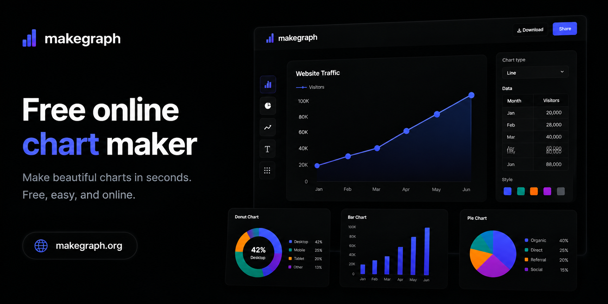
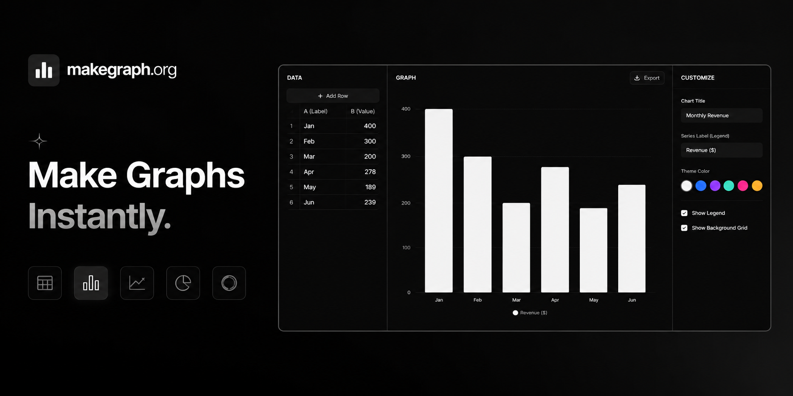
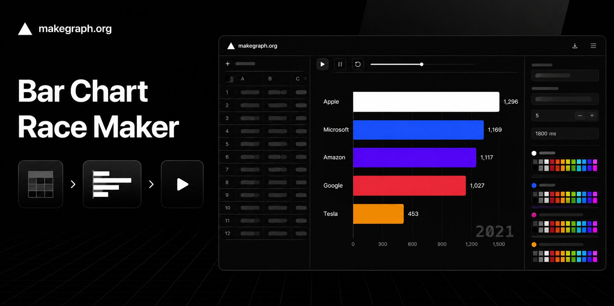
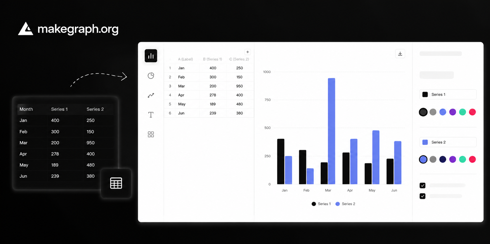
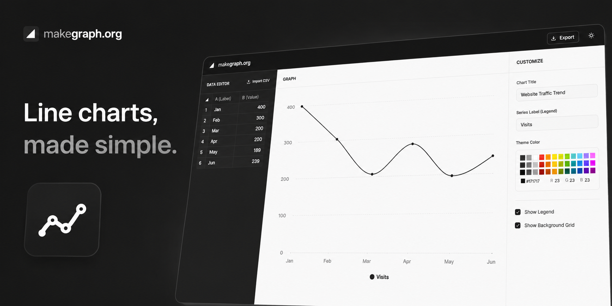
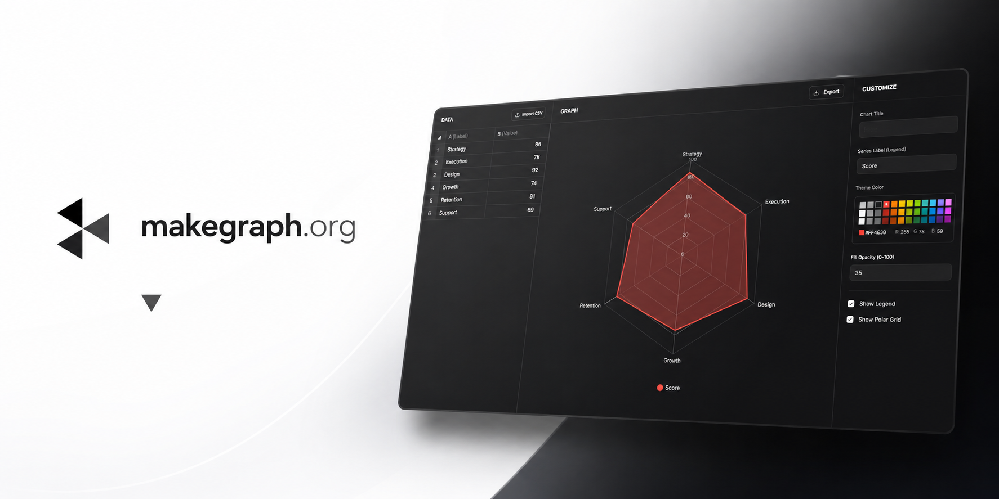
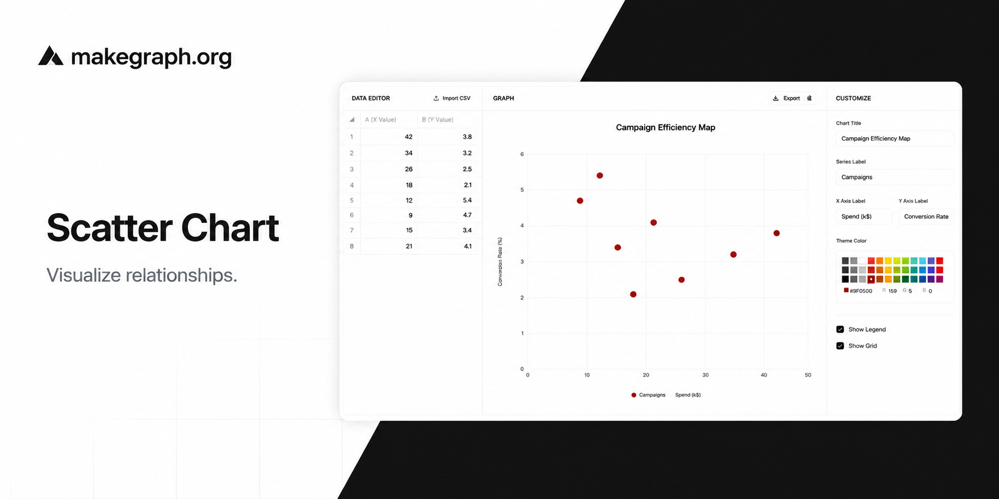
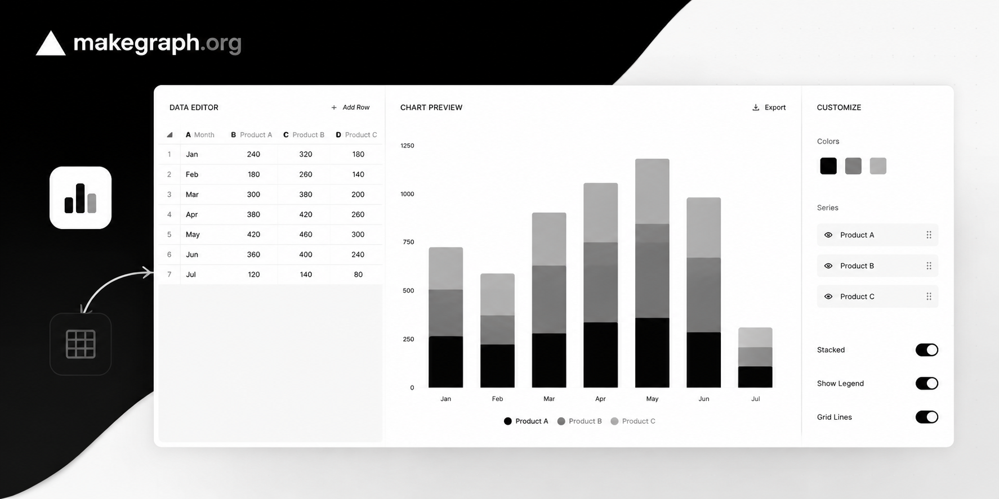
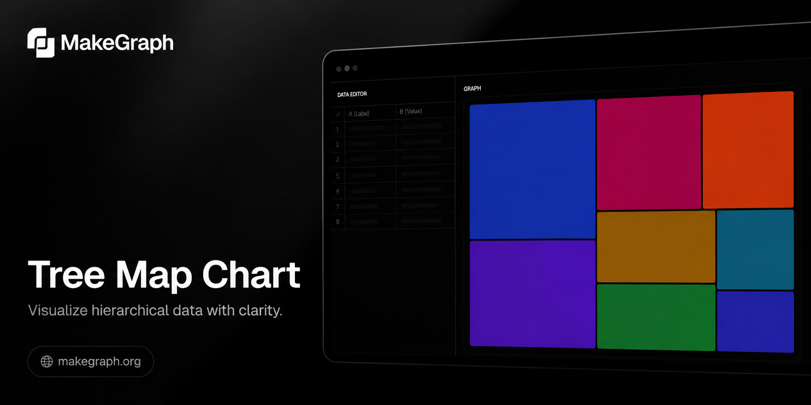
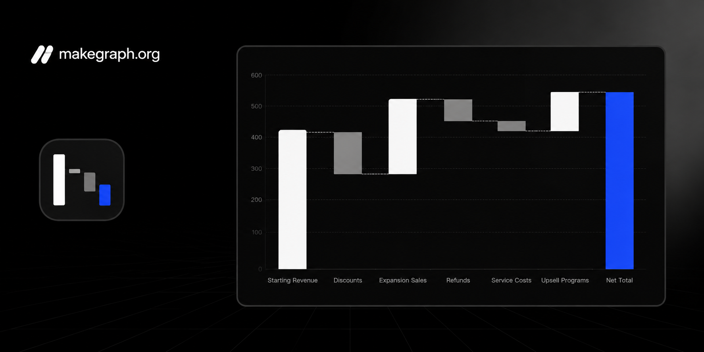

# MakeGraph

[English](README.md) | [中文](README_ZH.md)

MakeGraph 是 [makegraph.org](https://makegraph.org) 的代码仓库。项目基于 Next.js、TypeScript 和 React 构建，主要面向图表生成、图表落地页和相关内容页面。



## 项目概览

MakeGraph 主要关注一条相对明确的链路：把结构化数据转成图表页面和可编辑的图表体验，并尽量降低接入和使用成本。

当前仓库包含：

- 带实时预览和 PNG 导出的交互式图表编辑器
- 多语言图表页面和图表说明文案
- 与图表互相关联的博客、模板页
- 通用 UI 组件、图表工具函数和表格编辑能力
- 后续产品能力可复用的鉴权与数据库基础设施

## 功能概览

- 全屏图表编辑器与实时预览
- 图表内容导出为 PNG
- 基于 `next-intl` 的多语言图表页面
- 可复用的数据表格编辑能力
- 图表页、博客页、模板页之间的关联能力
- 面向落地页和编辑面板的共享 UI 体系

## 预览

当前已存在的统计图预览如下。

|                                                                                                                                                                                |                                                                                                                                                                       |                                                                                                                                                                             |
| ------------------------------------------------------------------------------------------------------------------------------------------------------------------------------ | --------------------------------------------------------------------------------------------------------------------------------------------------------------------- | --------------------------------------------------------------------------------------------------------------------------------------------------------------------------- |
| [](https://makegraph.org/charts/bar-chart)<br/>[柱状图](https://makegraph.org/charts/bar-chart)                                 | [](https://makegraph.org/charts/bar-chart-race)<br/>[柱状图竞赛](https://makegraph.org/charts/bar-chart-race) | [](https://makegraph.org/charts/double-bar-chart)<br/>[双向柱状图](https://makegraph.org/charts/double-bar-chart) |
| [](https://makegraph.org/charts/line-chart)<br/>[折线图](https://makegraph.org/charts/line-chart)                              | [](https://makegraph.org/charts/radar-chart)<br/>[雷达图](https://makegraph.org/charts/radar-chart)                  | [](https://makegraph.org/charts/scatter-chart)<br/>[散点图](https://makegraph.org/charts/scatter-chart)                  |
| [](https://makegraph.org/charts/stacked-bar-chart)<br/>[堆叠柱状图](https://makegraph.org/charts/stacked-bar-chart) | [](https://makegraph.org/charts/tree-map-chart)<br/>[矩形树图](https://makegraph.org/charts/tree-map-chart)     | [](https://makegraph.org/charts/waterfall-bar-chart)<br/>[瀑布柱状图](https://makegraph.org/charts/waterfall-bar-chart) |

## 技术栈

- Next.js 16 App Router
- React 19
- TypeScript
- Tailwind CSS 4
- ECharts 与 Recharts
- next-intl
- tRPC
- Drizzle ORM
- Better Auth
- PostgreSQL
- Biome

## 当前包含的图表页面

目前仓库中已经实现或接入的图表页面包括：

- 柱状图
- 柱状图竞赛
- 双向柱状图
- 折线图
- 雷达图
- 散点图
- 堆叠柱状图
- 矩形树图
- 瀑布柱状图

## 环境变量

复制 `.env.example` 为 `.env` 后，至少需要配置以下变量：

- `DATABASE_URL`：PostgreSQL 连接字符串
- `BETTER_AUTH_SECRET`：Better Auth 使用的密钥
- `NEXT_PUBLIC_SITE_URL`：站点公开访问地址，例如 `http://localhost:3001`
- `NEXT_PUBLIC_GOOGLE_ANALYTICS_ID`：可选的分析统计 ID

## 本地开发

### 1. 安装依赖

```bash
pnpm install
```

### 2. 创建本地环境变量

```bash
cp .env.example .env
```

至少需要根据本地环境配置以下变量：

- `DATABASE_URL`
- `BETTER_AUTH_SECRET`
- `NEXT_PUBLIC_SITE_URL`

### 3. 准备数据库

如果你本地使用 PostgreSQL，可先推送当前 schema：

```bash
pnpm db:push
```

### 4. 启动开发服务器

```bash
pnpm dev
```

默认访问地址为 `http://localhost:3001`。

## 部署说明

这个项目本质上是一个依赖 PostgreSQL 的标准 Next.js 应用。

- 在部署平台中配置必需的环境变量
- 确保目标数据库可访问
- 生产环境构建使用 `pnpm build`
- 将 `NEXT_PUBLIC_SITE_URL` 设置为实际部署域名

## 常用脚本

- `pnpm dev`：启动开发服务器，端口为 `3001`
- `pnpm build`：生成 Drizzle 产物并构建生产包
- `pnpm start`：启动生产环境服务
- `pnpm preview`：构建并启动预览环境
- `pnpm check`：执行 Biome 检查
- `pnpm check:write`：执行 Biome 检查并自动写入安全修复
- `pnpm typecheck`：执行 TypeScript 类型检查
- `pnpm db:generate`：生成 Drizzle 文件
- `pnpm db:push`：将 schema 推送到当前数据库
- `pnpm db:migrate`：执行数据库迁移
- `pnpm db:studio`：打开 Drizzle Studio

## 目录结构

```text
.
├── docs/                # 产品、SEO、营销等说明文档
├── drizzle/             # 数据库迁移文件
├── messages/            # 全局多语言消息
├── public/              # 静态资源
├── src/
│   ├── app/             # Next.js 路由与页面内容
│   ├── components/      # 通用 UI 和图表组件
│   ├── config/          # 图表和博客配置
│   ├── i18n/            # 语言路由与请求工具
│   ├── lib/             # 共享工具与站点配置
│   ├── server/          # 鉴权、数据库与 tRPC 服务端代码
│   └── styles/          # 全局样式
├── .env.example
└── package.json
```

## 文档说明

- 图表专属 markdown 文档放在对应 chart 目录中，例如 `src/app/[locale]/charts/*`
- 非页面类的产品规划、SEO、营销资料统一放在 `docs/`
- 原先偏营销风格的 README 已移动到：
  - `docs/marketing/README.md`
  - `docs/marketing/README_ZH.md`

## 后续方向

- 在保持编辑器轻量的前提下继续补充更多图表类型
- 增加更多可复用的模板页面和示例
- 继续完善图表页文案、SEO 和站内关联
- 逐步接入现有的鉴权和数据库基础设施，承载后续产品流程

## 参与开发

1. 执行 `pnpm install`
2. 复制 `.env.example` 为 `.env`
3. 完成代码或文档修改
4. 执行 `pnpm check:write`
5. 提交变更并发起 PR

## License

本项目采用 GNU Affero General Public License v3.0 许可证 - 详见 [LICENSE](LICENSE) 文件。
